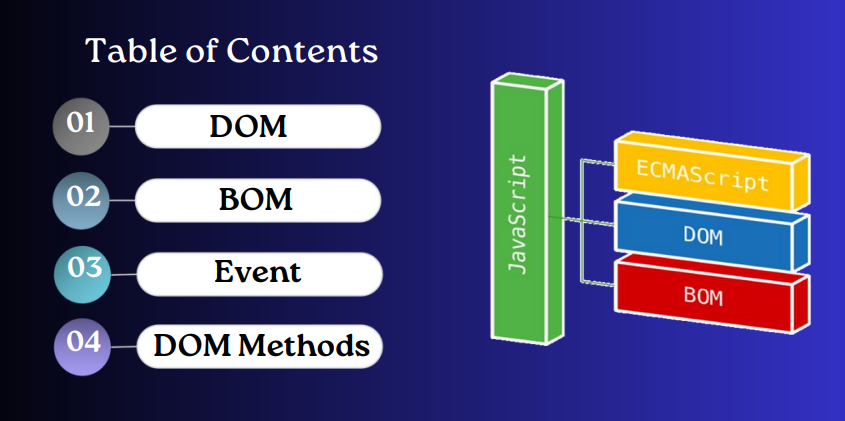
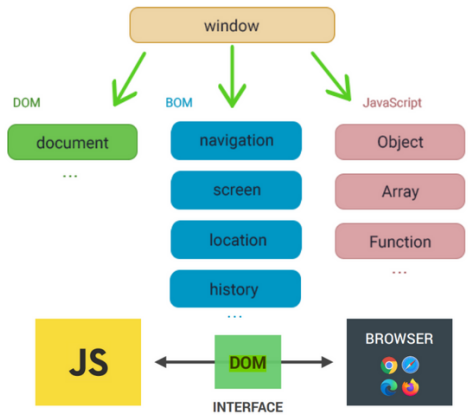
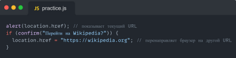
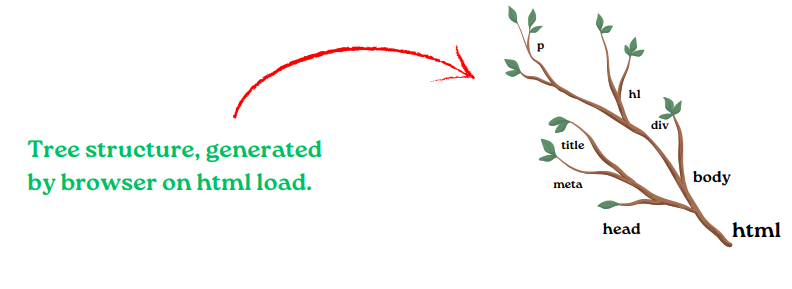
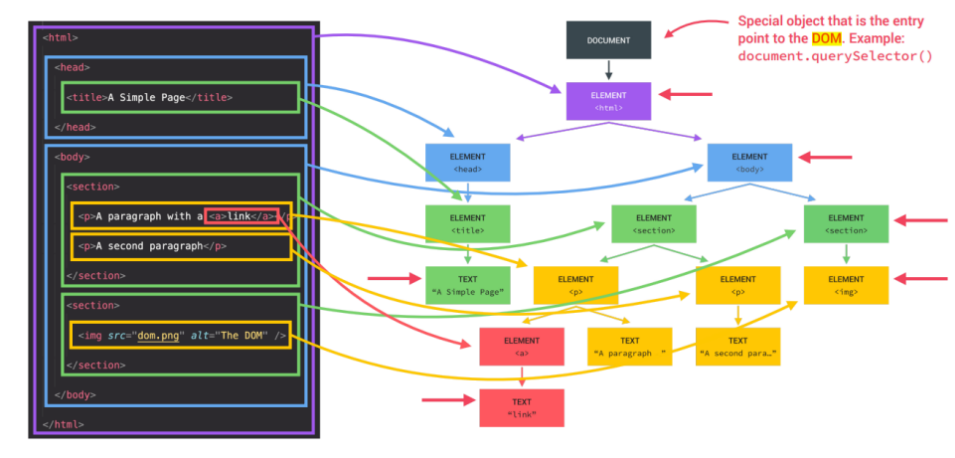
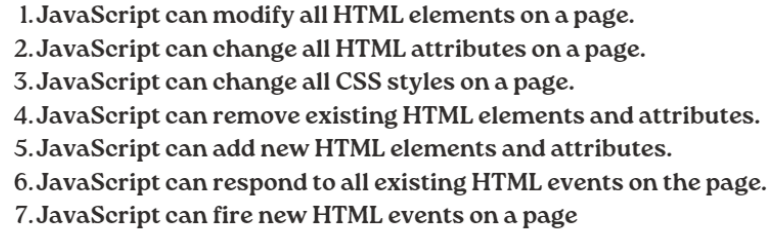
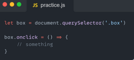
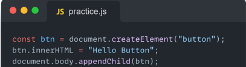
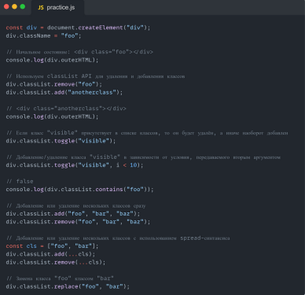

# Что такое BOM в JavaScript?

## Объектная модель браузера (BOM) позволяет JavaScript «общаться» с браузером
## Объектная модель браузера (BOM) — это дополнительные объекты, предоставляемые браузером (средой) для работы со всем, кроме документа.

# Что такое DOM в JavaScript?
## DOM — «Document Object Model». Это стандартизированный способ представления структуры документа (например, HTML) в виде древовидной структуры, где каждый узел представляет часть документа, например, элемент, атрибут, текстовое содержимое и т. д. DOM позволяет программам и скриптам получать доступ, управлять и обновлять содержимое, структуру и стили веб-страницы. JavaScript обычно используется для взаимодействия с DOM в веб-разработке для таких задач, как динамическое изменение содержимого страницы или обработка пользовательских событий.

## Согласно объектной модели документа (DOM для краткости), каждый тег HTML является объектом. Подтеги являются «потомками» родительского элемента. Текст, который находится внутри тега, также является объектом. Все эти объекты доступны с помощью JavaScript, мы можем использовать их для изменения страницы.

## Определение и использование. Метод querySelector() возвращает первый дочерний элемент, который соответствует указанному селектору CSS элемента, метод querySelectorAll() можно использовать для доступа ко всем элементам, которые соответствуют указанному селектору CSS.
## innerHTML - это свойство полностью обеспечивает простой способ замены элементарного элемента. Например, все требования тела элемента можно удалить:
# Объект Style представляет собой индивидуальное выражение стиля.
## События HTML — это «вещи», которые происходят с элементами HTML. Когда JavaScript используется на страницах HTML, JavaScript может «реагировать» на эти события.
## Событие HTML может быть действием браузера или действием пользователя.
## Вот несколько примеров событий HTML:
## Завершение загрузки веб-страницы HTML
## Изменение поля ввода HTML
## Нажатие кнопки HTML JavaScript позволяет выполнять код при обнаружении событий.

## onclick — пользователь нажимает на HTML-элемент
## Метод JavaScript document.createElement() позволяет создать и вернуть новый элемент (пустой узел Element) с указанным именем тега.
## 1. createElement(elementName): Создает элемент html, тег которого передается как параметр. Возвращает созданный элемент

## Метод appendChild() добавляет узел (элемент) в качестве последнего дочернего элемента. appendChild() добавляет узел в конец списка дочерних элементов указанного родительского узла. Если заданный дочерний элемент является ссылкой на существующий узел в документе, то функция appendChild() перемещает его из текущей позиции в новую позицию
## Element.classList — это свойство только для чтения, которое содержит текущую коллекцию DOMTokenList всех атрибутов класса элемента. Использование classList обеспечивает более удобный способ, чем доступ к списку классов элемента в виде строки, разделенной пробелами, через element.className.

## ClassList — это геттер. Возвращаемый им объект имеет несколько методов: add( String [,String] ) Добавляет указанные классы к элементу remove( String [,String] ) Удаляет указанные классы из элемента toggle(String[, Boolean]) Если у элемента нет класса, он добавляет его, в противном случае он удаляет его. Когда в качестве второго параметра передается false, он удаляет указанный класс, а если true, он добавляет его. Если второй параметр не определен или является переменной с typeof == 'undefined', поведение такое же, как при передаче только первого параметра при вызове
